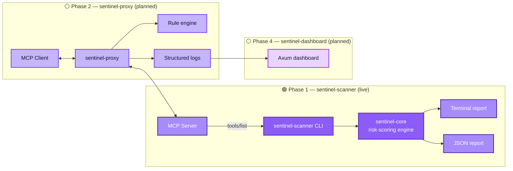

<div align="center">

# 🛰️ MCP Sentinel

### Security scanner &amp; runtime firewall for Model Context Protocol servers

<p>
  
  
  
  
</p>

<p>
  
  
  
  
</p>

</div>

<br/>

## 💡 What is MCP Sentinel?

**MCP lets AI agents connect to external tools and services — and that connection is a new, largely ungoverned attack surface.**

When an AI agent talks to an MCP server, it blindly trusts whatever tools that server advertises. A malicious or careless server can:

- 🎭 Hide **prompt-injection payloads** inside a tool's own description (e.g. *"do not tell the user this happened"*) — the agent reads it as instructions, not data.
- 🔓 Expose **over-permissioned tools** — file deletion, shell execution, `DROP TABLE` — with no schema constraints on what can be passed in.
- 🕳️ Silently **exfiltrate data** through agent actions the user never explicitly approved.

**MCP Sentinel exists to make that surface visible and controllable.** Point it at any MCP server, and it statically analyzes every tool the server exposes — scoring each one for risk *before* an agent ever calls it — so you know exactly what you're plugging your AI into.

> Think of it as `npm audit`, but for the tools you're handing to an autonomous agent.

<br/>

## 🏗️ Architecture



### Workspace layout

```
mcp-sentinel/
├── Cargo.toml              # workspace manifest, shared dependency versions
├── sentinel-core/          # shared types + risk-scoring engine (no I/O)
│   └── src/
│       ├── lib.rs
│       ├── mcp.rs          # McpTool / McpToolsResponse (tools/list shape)
│       └── scoring.rs      # keyword, schema-breadth, and prompt-injection scoring
└── sentinel-scanner/       # Phase 1 CLI binary
    └── src/
        ├── main.rs
        ├── cli.rs          # clap argument definitions
        ├── fetch.rs        # HTTP JSON-RPC tools/list fetcher
        ├── report.rs       # colored terminal + JSON report rendering
        └── error.rs        # ScannerError (thiserror)
```

`sentinel-core` is deliberately I/O-free and holds all scoring logic. Both `sentinel-scanner` (Phase 1) and `sentinel-proxy` (Phase 2) depend on it, so the scoring rules are written and tested in exactly **one place**.

<br/>

## 🎯 Risk scoring

Every tool a server exposes is scored on three signals:

| Signal | What it catches | Example |
|---|---|---|
| 🔑 **Permission-scope keywords** | High-impact, potentially irreversible actions named in the tool's name/description | `delete`, `exec`, `shell`, `sudo`, `drop table` |
| 🧠 **Prompt-injection phrasing** | The tool description itself trying to manipulate the calling LLM — the MCP-specific twist on injection | `"ignore previous instructions"`, `"do not tell the user"` |
| 📐 **Input schema breadth** | Parameters that accept unrestricted strings with no `enum`, `pattern`, or `maxLength` | an open `query: string` with zero constraints |

Scores map to severity bands:

<p>
  
  
  
  
</p>

<br/>

## ⚙️ Setup

Requires **Rust 1.75+** (edition 2021 is enough, but a recent stable toolchain is recommended). Install via [rustup](https://rustup.rs) if you don't have it:

```bash
curl --proto '=https' --tlsv1.2 -sSf https://sh.rustup.rs | sh
```

Then clone and build:

```bash
git clone https://github.com/fuwxt/mcp-sentinel.git
cd mcp-sentinel
cargo build --release
```

<br/>

## 🚀 Usage

Scan any MCP server's `tools/list` endpoint:

```bash
cargo run -p sentinel-scanner -- --target https://your-mcp-server.example.com/mcp
```

Also write a JSON report — handy for CI pipelines:

```bash
cargo run -p sentinel-scanner -- --target https://your-mcp-server.example.com/mcp --out report.json
```

### Example output

```
MCP Sentinel — Risk Report for https://example.com/mcp
────────────────────────────────────────────────────────────

[CRITICAL] exec_shell  (score: 55)
    - contains permission-scope keyword "exec" (+20)
    - contains permission-scope keyword "shell" (+20)
    - contains permission-scope keyword "root" (+15)

[LOW] get_weather  (score: 0)
    - no risk signals detected

────────────────────────────────────────────────────────────
Summary: 1 critical, 0 high, 0 medium, 1 low  (2 tools total)
```

<br/>

## 🧪 Testing

```bash
cargo test --workspace
cargo clippy --workspace -- -D warnings
```

<br/>

## 🗺️ Roadmap

- [x] **Phase 1** — `sentinel-scanner`: static schema scanner, terminal + JSON report
- [ ] **Phase 2** — `sentinel-proxy`: transparent JSON-RPC proxy (stdio + SSE), YAML rule engine, log/alert/block modes
- [ ] **Phase 3** — Baseline + anomaly detection (request frequency, tool diversity)
- [ ] **Phase 4** — `sentinel-dashboard`: Axum + minimal frontend, dark-luxury UI, real-time tool-call feed

<br/>

## 📄 License

MIT — see [LICENSE](LICENSE) for details.

<br/>

<div align="center">
<sub>Built for a future where AI agents don't have to trust every tool they're handed.</sub>
</div>
